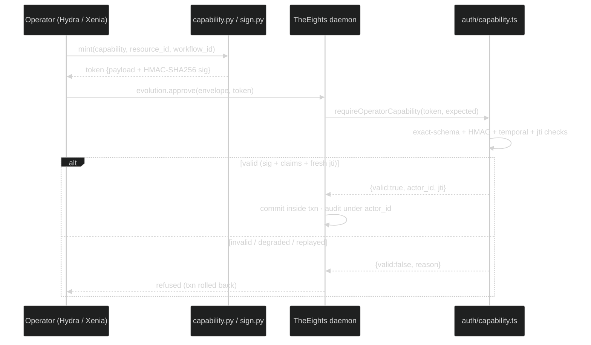

# TheEights — Persistent, Self-Evolving Agent Fabric

> A local-first daemon + MCP server that gives every AI agent, team, and project across the workspace a **shared persistent memory**, a **governance plane**, and a **gated self-evolution loop**. Domain-agnostic by design.

**Status:** Architecture v0.3.0 (May 2026)
**Author of record:** decisions locked via /goal — robob
**Companion docs:** `Architecting Enterprise Multi-Agent Systems in 2026 — Persistent Memory, Orchestration Layers, and Self-Evolving Capabilities.md` (reference research)

---

## 1. Why "TheEights"

TheEights is not another orchestrator, agent framework, or executive suite. It is the **substrate layer** that the consumer systems in this workspace converge on. The five wired consumers (each with its own watcher/bridge + bulk registrar) are:

| System | Role | Today's memory state |
|---|---|---|
| **Hydra** | LangGraph supervisor / squad dispatcher | 3-tier fabric *declared*, not implemented; SqliteSaver checkpoints only |
| **ExecutiveSuite** | 20 C-suite agents + 4 multi-exec orchestrators | None — markdown artifacts only |
| **pair-programmer** | 39 sub-agents, 22 teams, taxonomy gates, judges | Rich per-project SQLite + `PROJECT_MASTER.md`; no cross-project layer |
| **RLM-CLI-Starter (+14 RLM* siblings)** | 9-phase pipeline, 4-CLI parity | Per-project `events.jsonl`; Copilot Memory only |
| **Xenia** | Customer-support squad — soteria-crew sub-agents, ticket + VoC pipeline (active consumer, not a stub) | Per-project `hearth/progress/events.jsonl`; no governed cross-project layer |

Every one of these has rich *per-run* state and prose-level governance intentions. None has cross-project, governed, auditable, self-evolving memory. **That is the gap, and TheEights fills it.**

The name evokes (a) the 8 reference-doc layers (LASM), (b) the 8 chambers of a typical enterprise C-suite, (c) the 8-ball — opaque but answers. Pick whichever metaphor sticks.

---

## 2. Design principles (non-negotiable)

1. **Local-first, single binary.** Daemon process on localhost, single user, no external services in v1 except opt-in cloud LLM/embedding providers gated behind `EIGHTS_ALLOW_CLOUD_PROVIDERS=1`. Cloud profile later, behind the same MCP surface.
2. **Substrate, not framework.** TheEights does not own orchestration. It owns memory, audit, and evolution gating. Consumers stay in their own paradigms (LangGraph, Claude Code agents, MCP).
3. **Domain-agnostic.** No baked-in industry verticals. A new domain (legal, healthcare, game-dev, finance) is a namespace + scope, not a code change.
4. **MCP-first surface.** Everything exposed to agents is an MCP tool/resource. CLI is a thin shim over MCP.
5. **Hybrid memory.** Vectors for first-pass recall, graph for relational/episodic reconstruction, episodic SQL for audit. Three access paths, one logical store.
6. **Governed evolution.** Every modifiable resource (prompts, teams, rubrics, memory schemas, workflows) is a *versioned resource* (Autogenesis RSPL). Changes require SSGM-style gates + HITL for non-low-risk classes.
7. **Replayable.** Any past run, decision, or evolution proposal must be reconstructible from the daemon state. No silent mutation.
8. **Defense in depth.** LASM-style controls at each layer. Zero-trust on memory access — every read/write carries a tenant + scope + policy check.

---

## 3. Layered architecture

```
┌─────────────────────────────────────────────────────────────────────────┐
│  Layer 7 — Adapters (per-consumer integration)                          │
│    pp │ hydra │ execsuite │ rlm │ xenia bridges │ (future)              │
├─────────────────────────────────────────────────────────────────────────┤
│  Layer 6 — MCP surface  (eights-mcp)                                    │
│    eights.memory.*   eights.governance.*   eights.evolution.*           │
│    eights.audit.*    eights.identity.*     eights.observability.*       │
├─────────────────────────────────────────────────────────────────────────┤
│  Layer 5 — Cognitive services                                           │
│    Memory Steward │ Governance Agent │ Evolution Coach │ Cost Analyst   │
├─────────────────────────────────────────────────────────────────────────┤
│  Layer 4 — Core engines                                                 │
│    Memory Engine │ Audit Engine (Agent-BOM) │ Evolution Engine (RSPL)   │
│    Policy Engine (SSGM+LASM) │ Identity & Scope Engine                  │
├─────────────────────────────────────────────────────────────────────────┤
│  Layer 3 — Storage drivers                                              │
│    sqlite-vec (vectors) │ Kuzu (graph) │ SQLite (episodic + audit + KV) │
│    Append-only event log (.jsonl)                                       │
├─────────────────────────────────────────────────────────────────────────┤
│  Layer 2 — Daemon runtime (eights-daemon, Node 20 LTS)                  │
│    Process supervisor │ Stdio + WS MCP transports │ Hooks │ Health      │
├─────────────────────────────────────────────────────────────────────────┤
│  Layer 1 — Filesystem                                                   │
│    ~/.eights/  (state.db, vectors.db, graph.kuzu/, logs/, evolution/)   │
└─────────────────────────────────────────────────────────────────────────┘
```

> **Consumer surfaces beside the CLI.** The `web/` package (Living Agent-BOM Atlas) is a
> consumer-style sibling of `daemon/` and `cli/`. Like the CLI it is **just another MCP
> client over the existing stdio boundary** — it adds no new daemon surface and makes no
> changes under `daemon/src/`. Its **read** path is read-only by construction (fixed
> `eights-atlas` envelope, empty scope, read whitelist + denylist, loopback + `GET`-only).
> As of the `atlas-hitl-actions-2026-06-01` campaign it ALSO has a **governed
> operator-write path** (Atlas is no longer purely read-only): a *separate*, CSRF-gated,
> POST-only path with a distinct, minimal allowlist of EXACTLY
> `{evolution.approve, evolution.reject, evolution.rollback}` and a distinct operator
> envelope (actor `operator-rob`, domain `governance`, minimal hard-coded scope). It lets
> the operator Approve / Reject / Rollback self-evolution proposals from the browser by
> invoking ONLY the governed `eights.evolution.*` tools — so the Evolution Engine + Policy
> Engine still enforce policy/HITL/frozen-refusal/write-back/audit (frozen/critical
> resources are refused server-side pending an operator `unfreeze`). The operator action is
> the operator-signed override Hard Invariant #5 requires; every action is audited under
> `operator-rob`. The §12 Hard Invariants are unchanged. See `web/README.md`.

### Why this stack on Windows / local

- **SQLite** — single file, WAL mode, transactional. Already proven in pair-programmer.
- **sqlite-vec** — embedded vector extension; no Postgres process required (the user's locked constraint). pgvector driver added later for the cloud profile behind the same `VectorStore` interface.
- **LadybugDB** (active fork of Kuzu, since Kuzu was archived after Apple's Oct 2025 acquisition) — embedded property graph DB; single directory, Cypher subset. Avoids running Neo4j or Memgraph as a service. Kuzu 0.11.x is kept as a fallback driver.
- **Node 20 LTS** — matches the pair-programmer daemon, lets us reuse its hook/MCP patterns. Python adapter is offered for consumers (Hydra is Python-native).

---

## 4. Logical data model

### 4.1 Identity & scope

Every memory operation carries an envelope:

```ts
type Envelope = {
  tenant_id: string;        // "local" in v1
  actor_id: string;         // agent or human identifier
  project_id: string;       // e.g. "pair-programmer", "ExecutiveSuite", "RLMcoding"
  domain: string;           // "code" | "exec" | "creative" | "research" | ...
  scope: string[];          // tags: ["public", "team:feature-team", "sensitive:no"]
  trace_id: string;         // OTEL-compatible
  parent_trace_id?: string;
};
```

Scopes are how a new industry/agent plugs in — no schema change required.

### 4.2 Memory types (CoALA-aligned)

| Type | Backing | Lifetime | Examples |
|---|---|---|---|
| **Working** | In-process LRU + SQLite spill | minutes | active turn buffer |
| **Episodic** | SQLite + jsonl event log | unbounded; tiered decay | run summaries, decision memos, dissent records |
| **Semantic** | sqlite-vec + Kuzu | unbounded; consolidated | facts, glossaries, schemas, personas |
| **Procedural** | Kuzu + signed resource store | versioned, never deleted | prompts, teams, rubrics, workflows, tool wrappers |
| **Meta** | SQLite KV | versioned | policies, profiles, learned weights, gate thresholds |

Each memory carries: `{id, type, embedding_id?, graph_node_id?, content, summary, provenance{run,actor,model,seed}, scopes[], created_at, expires_at?, confidence, supersedes?[], superseded_by?[]}`.

### 4.3 Resource registry (Autogenesis RSPL)

`procedural` and `meta` memories are *resources* with explicit versioned lifecycles:

```ts
type Resource = {
  rid: string;              // "resource:pp.team.feature-team"
  kind: "prompt" | "team" | "rubric" | "tool" | "workflow" | "schema" | "policy";
  risk_class: "low" | "medium" | "high" | "critical";
  current_version: string;
  versions: ResourceVersion[]; // signed, content-addressed
  evolution_policy: "auto" | "auto-low-risk" | "hitl-only" | "frozen";
  audit_url: string;        // graph path into Agent-BOM
};
```

**Risk classification (v1):**

- **low** → docs prompts, formatting templates, comment styles, changelog templates
- **medium** → engineering team compositions, non-critical rubrics, retrieval prompts
- **high** → security/contract/spec gates, judging rubrics, taxonomy mappings
- **critical** → policy rules, identity/scope rules, governance gates themselves

The locked v1 evolution stance — *auto-commit on low-risk, HITL on the rest* — maps directly to `evolution_policy` defaults by `risk_class`.

### 4.4 Audit graph (Agent-BOM)

Every run, every memory write, every evolution proposal is a node + edges in Kuzu:

```
(:Run)-[:PRODUCED]->(:Artifact)
(:Run)-[:WROTE]->(:Memory)
(:Memory)-[:LINKS_TO]->(:Memory)
(:Memory)-[:SUPERSEDES]->(:Memory)
(:Decision)-[:ASSUMES]->(:Assumption)-[:OUTCOME]->(:Outcome)
(:Resource)-[:HAD_VERSION]->(:ResourceVersion)
(:EvolutionProposal)-[:PROPOSES]->(:ResourceVersion)
(:EvolutionProposal)-[:APPROVED_BY|REJECTED_BY]->(:Actor)
(:Dissent)-[:RAISED_BY]->(:Actor)-[:CALIBRATED_BY]->(:Outcome)
```

This is the single auditable trace. Replay = walk the graph from a Run.

---

## 5. MCP tool surface (v1)

All tools take an `Envelope` (above) and return JSON.

### `eights.memory.*`
- `add(content, type, scopes, links?[], confidence?) → memory_id`
- `search(query, type?[], scopes?[], top_k=10, fusion="hybrid") → MemoryHit[]`
  - Hybrid = vector first-pass + graph reranking
- `get(memory_id) → Memory`
- `link(from, to, relation, weight?) → edge_id`
- `consolidate(memory_ids[], strategy="merge"|"hierarchical") → memory_id`
- `decay_tick()` — internal scheduler entry; not for agents

### `eights.governance.*`
- `policy.evaluate(action, envelope) → {allow, reason, requires_hitl}`
- `policy.list(scope?) → Policy[]`
- `redact(text, scopes) → text` — applied at MCP boundary
- `consistency_check(memory_id, new_content) → {ok, conflicts[]}` (SSGM)
- `access.check(actor, target_scopes) → boolean` (LASM)

### `eights.evolution.*`
- `register(...)` / `get_resource(rid)` / `list_resources({consumer?, kind?, risk?}, {limit?, offset?}) → Page<Resource>`
- `propose(resource_rid, candidate_version, justification, evidence_memory_ids[]) → proposal_id`
- `evaluate(proposal_id) → EvaluationReport` — runs evals, smoke tests
- `commit(proposal_id) → version_id` — auto-commits if `risk_class=low`; otherwise queues for HITL
- `approve(proposal_id, actor) → version_id` — **operator-capability-gated** (see §5.1)
- `reject(proposal_id, ...)` — **operator-capability-gated**
- `rollback(resource_rid, to_version) → version_id` — **operator-capability-gated**
- `unfreeze(rid) → ...` — **operator-capability-gated**
- `list_pending({limit?, offset?}) → Page<Proposal>`
- `detect_drift({limit?, offset?}) → Page<DriftEntry>` — paginates over drift entries; carries `total` + `total_resources` + `has_more`
- `reconcile_drift({rid?, dryRun?, limit?, offset?}) → {planned, total_drifts, applied, has_more}`

> **Pagination.** The list/drift tools accept `limit` (clamped to `[1,200]`, default 50) and `offset` (clamped `>=0`). Responses are a `Page<T>` envelope with `total` + `has_more` so consumers page deterministically; an over-large `limit` is clamped, never rejected (`engines/evolution.ts → clampPage`).

### `eights.audit.*`
- `trace(run_id|decision_id) → AuditGraph`
- `bom(project_id, since?) → CycloneDXMLBOM` — CycloneDX ML-BOM v1.7 export (de-facto Agent-BOM as of 2026; no dedicated standard exists yet)
- `replay(run_id) → ReplayBundle`

### `eights.identity.*`
- `register_project(name, domain, scopes_default[]) → project_id`
- `register_actor(name, kind, parent?) → actor_id`
- `whoami() → Envelope`

### `eights.observability.*`
- `events.tail(filter) → SSE stream`
- `metrics() → {tokens, latency_ms, gate_pass_rate, drift_indicators}`

### `eights.constitution.*` (Phase 6 — manifesto alignment)
- `get(consumer) → {text, version, hash, frozen}`
- `attest(consumer) → ConstitutionReceipt` — hash-chained binding of a workflow run to a specific constitution. Refuses on missing/drifted.
- `propose_amendment(consumer, draft, rationale) → Proposal` — always HITL; even after operator unfreeze, no auto-commit.

### `eights.hydra.*` (Phase 6)
- `envelope.record(hydra_envelope)` — durable + audited + semantically indexed record of any HydraEnvelope subtype.
- `envelope.query({workflow_id?, type?, target_squad?, origin_squad?, since?, limit?})` — precedent retrieval.
- `handoff.list(workflow_id) → Handoff[]` — every cross-squad delegation in a workflow.

### `eights.squad.*` (Phase 6)
- `list({active_only?})` — every Hydra squad as a kind=squad resource.
- `get(squad_id)` — YAML body + version + risk_class.

### `eights.prompt.*` (Phase 6)
- `list({consumer?})` — every agent prompt across the consumer repos.
- `get(rid)` — current prompt body + version + evolution_policy.
- `diff(rid, from_version?, to_version?)` — unified line diff for HITL reviewers.

### `eights.cells.*` (Phase 6)
- `distribution({workflow_id?, project_id?, since?}) → {vision, context, triggers, influence, risk, focus, constraints, delight, untagged}`
- `query(cell, top_k=20)` — recent memories tagged with one cell.
- `classify(text, summary?)` — keyword-first 8-cell classifier with optional local-Ollama fallback.

### `eights.governance.*` (Phase 6 — extended)
- `budget.charge(run_id, cost_usd, tokens?) → {action: proceed|downgrade|block}` — durable across daemon restart.
- `ceiling.tick(run_id, kind: iteration|depth|failure)` — manifesto's loop ceilings.
- `cap.set(run_id, kind, cap)` — per-run cap override. **operator-capability-gated** (see §5.1).
- `hitl.request(kind, payload, run_id?)` / `hitl.resolve(request_id, decision)` — `hitl.resolve` is **operator-capability-gated** — / `hitl.list(status?)`
- `breaker.status(node_id)` / `breaker.outcome(node_id, success|failure)` / `breaker.reset(node_id)`
- `redact_for_squad(target_squad, payload)` — applies the target squad's redaction policy resource.

### `eights.memory.*` (Phase 6 — extended)
- `resolve(handle_or_id)` — accepts `ep://`, `sem://`, `proc://`, `meta://`, `mem://`, or raw id.
- `resolve_batch(handles[])` — bulk fetch used by supervisors hydrating envelope context refs.

### 5.1 Operator capability tokens (governance-write enforcement)

A subset of write tools — the ones that let a human override the gates (`evolution.approve`, `evolution.reject`, `evolution.rollback`, `evolution.unfreeze`, `governance.cap.set`, `governance.hitl.resolve`) — require a signed **operator capability token** in addition to the envelope. The verifier is `daemon/src/auth/capability.ts`; the engines (`engines/evolution.ts`, `engines/governance-state.ts`) call `requireOperatorCapability(...)` inside the same transaction as the mutation, so a missing or invalid token rolls the write back.

This is the **mint → inject → verify** flow seen from the daemon (verify) side:

- **Mint (operator side).** Hydra's `hydra_core/auth/capability.py` (and Xenia's `sign.py`) mint the token: a canonical-JSON payload (`v=1, actor_id, actor_kind="human", capability, resource_id, workflow_id, issued_at, exp, jti`) signed **HMAC-SHA256** with `HYDRA_OPERATOR_KEY`, value base64url-encoded. The wire format is **byte-identical** across the Python minters and this TypeScript verifier (proven by golden-vector tests).
- **Inject.** The token rides alongside the envelope on the gated tool call.
- **Verify (TheEights side, fail-closed).** `verifyOperatorCapability` is wrapped in try/catch (never throws), normalises the token via JSON round-trip, enforces an **exact** schema (extra payload/sig fields rejected), checks `alg=HMAC-SHA256` and `key_id` match, recomputes the HMAC over the canonical bytes and compares with `timingSafeEqual`, then enforces semantics: `actor_kind="human"`, capability/`workflow_id`/`resource_id` must match expectations, `issued_at <= now`, bounded TTL (`exp - issued_at <= 86400`), not expired. The `jti` is single-use — callers consume it via a `consumed_capabilities` table to block replay.
- **Degraded mode.** A token with `sig.value=null` (minted when `HYDRA_OPERATOR_KEY` is unset on the minter — Hydra's degraded fallback) is **always rejected** here; the verifier also fails closed if its own `HYDRA_OPERATOR_KEY` is unset. Reason strings are static text and never interpolate token values.



### 5.2 AgentMesh enrollment

TheEights ships a `mesh-manifest.yaml` (`apiVersion: agentmesh/v1`, `kind: SiblingManifest`) at the repo root. The AgentMesh control plane (`meshd`) reads it and **owns the `eights` entry** in `~/.hydra/backends.json` — spawn spec (`daemon/dist/index.js`), stdio MCP endpoint + discovered tool names, lifecycle policy (start timeout, graceful shutdown, crash-loop breaker), and the constitution attest/audit-export tool bindings. Hand edits to the backends entry are reverted on the next enrollment sync. The manifest's `healthProbe` is an `mcp-tool-call` against **`eights.constitution.get`** (a cheap no-args read, 15s interval / 5s timeout) — it replaced `eights.audit.verify`, whose full chain walk (~20s) routinely timed out and false-tripped the crash-loop breaker on a healthy daemon. Deep chain integrity is still verified at startup (fail-closed readiness gate) and on demand via `eights.audit.verify`. See ADR-0009.

---

## 6. Component responsibilities

### 6.1 Memory Engine
Owns hybrid write/read across sqlite-vec + Kuzu + SQLite. Implements the Hierarchical Memory Orchestrator pattern (HMO): primary cache (in-process), secondary (SQLite hot tier), archive (Kuzu graph). Handles JIT reconstruction from graph for episodic queries.

### 6.2 Memory Steward (cognitive service)
LLM-backed agent that decides what gets written, when to consolidate, when to decay. Runs as a periodic job AND inline on `memory.add` (extraction pass).

### 6.3 Policy Engine
Pure-function policy evaluator. Loads policies from a signed resource (`resource:eights.policy.default`). Returns deterministic decisions; never calls an LLM. Two layers: **SSGM** (memory write/consolidate gates), **LASM** (cross-layer access gates).

### 6.4 Evolution Engine (Autogenesis core)
- **RSPL** — manages versioned resources, signing, content addressing.
- **SEPL** — accepts proposals from any actor, runs `evolution.evaluate` (eval suite from the consumer system's rubrics), routes to `commit` or HITL queue based on `risk_class` and `evolution_policy`.
- **Drift detector** — periodic job comparing live behavior against committed versions; flags suspicious mutations.

### 6.5 Audit Engine
Append-only `.jsonl` event log + Kuzu projection. Every MCP call lands here. Tamper-evident via running hash chain in the daemon_meta table.

### 6.6 Cost / Performance Analyst
Reads `metrics()`, projects spend, recommends model routing changes as evolution proposals against `resource:*.routing.policy` resources.

---

## 7. Self-evolution flow

```
┌───────────────────────┐
│ Consumer system runs  │   (e.g. pair-programmer /pp:run completes)
└──────────┬────────────┘
           │  finalize hook → eights.memory.add(run summary, verdicts, scores)
           ▼
┌───────────────────────┐
│ Memory Steward        │   episode extraction, deduplication, linking
└──────────┬────────────┘
           │
           ▼
┌───────────────────────┐
│ Pattern miner         │   nightly job: scans for repeated wins/losses,
│ (Cost+Memory Steward) │   surfaces candidate resource improvements
└──────────┬────────────┘
           │  eights.evolution.propose(...)
           ▼
┌───────────────────────┐
│ Evolution Engine      │   risk_class lookup
└──────────┬────────────┘
           │
   ┌───────┴─────────┐
   │                 │
   ▼                 ▼
 low-risk        medium+/high/critical
   │                 │
   ▼                 ▼
 evaluate          evaluate
 → commit         → queue for HITL  ──► you review via `/eights:review`
   │                 │                      │
   ▼                 ▼                      ▼
 audit edge      audit edge             on approve → commit; on reject → audit
```

**SSGM gates that fire on every commit:**
1. Consistency vs. existing memories of same type+scope
2. Temporal decay sanity (don't revive expired contradictions)
3. Access-control invariant (the change doesn't broaden access)
4. Safety filter invariant (safety filters are themselves `frozen` — can't be modified by evolution at all)
5. Eval delta — measured improvement on the consumer's rubric set ≥ 0 (else reject)

---

## 8. Integration adapters

### 8.1 pp-bridge (pair-programmer)
- **Listens to:** `finalize_run`, `record_verdict`, `archive_artifact` events from the pp daemon.
- **Writes:** run summary, verdict scores, taxonomy mapping, missability outcomes → episodic + semantic memory tagged `project_id=<project>`, `domain=code`.
- **Reads:** on `start_run`, fetches prior runs in this project + cross-project patterns for the same `team_yaml`. Injected into the orchestrator prompt as a "prior wisdom" block.
- **Evolution targets:** team yamls, rubric weightings, gate escalation thresholds (currently hardcoded in `daemon/src/orchestrator/gates.ts`).

### 8.2 hydra-bridge
- TheEights *is* Hydra's declared-but-unimplemented memory service. Drop-in for `MemoryRef` resolution.
- Implements `~/.hydra/episodic.db` shape by projecting from the eights graph (Hydra reads through an MCP proxy).
- LangGraph nodes call `eights.memory.search` inline; `MemoryRef` handles point at eights memory ids.

### 8.3 execsuite-bridge
- Wraps the `output/<domain>/` archival convention.
- Every M&A dossier, board minute, crisis log → episodic memory + Agent-BOM nodes (`Decision`, `Assumption`, `Dissent`, `Outcome`).
- 6 / 12 month post-deal review = scheduled job that fetches outcomes from the user (or external systems later) and links them to the original Assumption nodes. Dissent calibration scoring lives here.
- Optional: route boardroom decisions over $threshold to pp's `/pp:review` forum via the engine — TheEights brokers the handoff.

### 8.4 rlm-bridge
- Tails each RLM project's `RLM/progress/events.jsonl`.
- Normalizes events into episodic memory under `domain=<the RLM specialty>` (coding/design/finance/auth/etc.).
- Cross-RLM pattern mining is automatic — the 14 RLM* siblings finally talk to each other.

### 8.5 xenia-bridge (customer-support)
- **Listens to:** Xenia's `hearth/progress/events.jsonl` (ticket-created, ticket-resolved, escalated, VoC-report, output-written), tailed by `xenia-watcher`.
- **Writes:** normalizes each event into **`domain=customer-support`** episodic memory with explicit Eight-Cells tags — the squad's trigram manifesto compiled (`Kan→risk`, `Dui→delight`, `Xun→influence`). An *escalation* event writes **two** memories (risk + influence): the crossing is danger, the context that crossed is influence; one cell per memory is a schema invariant, so the pair is the faithful encoding.
- **Layer-4 redaction:** event content is PII-scrubbed **at the bridge** before `memory.add` — the bridge never trusts hook-side redaction alone (Xenia constitution Article IV: no single layer is ever trusted).
- **Registrar:** `xenia-registrar` bulk-registers Xenia's `.claude/` artifacts as evolvable resources — agents (incl. `soteria-crew/` sub-agents, `high`), skills (`low`), commands (`medium`), rubrics (`low`), the `squad.yaml` (`high`), and enforcement hooks (`pre-response-redaction` / `pre-tool-privilege` → `critical`; others `medium`). Roughly 48 resources at last sweep.
- **Lifecycle control:** `eights.adapters.xenia.{start,stop,sync_now,register_now}`.

### 8.6 Future adapters
Just register a new `project_id` and write an adapter that translates that system's events into eights memory ops. No core changes.

---

## 9. Filesystem layout (`~/.eights/`)

```
~/.eights/
  state.db                  # SQLite: episodic, audit, KV, identity, resources
  vectors.db                # sqlite-vec: embeddings (same connection ok)
  graph.kuzu/               # Kuzu directory
  events/
    2026-05-18.jsonl        # append-only audit/event log, one file per day
  resources/
    prompts/                # versioned content-addressed prompt store
    teams/
    rubrics/
    policies/
  evolution/
    pending/                # HITL queue
    archived/
  logs/
    eights-daemon-2026-05-18.log
  config.yaml               # daemon config (paths, ports, log levels)
```

`<project>/.eights/` (per-project, optional):
```
<project>/.eights/
  config.yaml               # project_id binding, default scopes, evolution_policy overrides
  events.jsonl              # local tail of project's audit slice
```

---

## 10. Repo layout (this directory)

```
TheEights/
  ARCHITECTURE.md           # this file
  ROADMAP.md                # phased plan (Phase 0..6, all complete)
  AGENTS.md                 # behavioral contract for AI agents working in this repo
  CLAUDE.md                 # Claude Code import shim → @AGENTS.md
  README.md                 # quickstart + ecosystem overview
  adrs/
    0001-sqlite-vec-over-pgvector.md
    0002-ladybug-over-kuzu.md
    0003-node-daemon-mcp-first.md
    0004-autogenesis-resource-model.md
    0005-ssgm-gate-set.md
    0006-risk-class-evolution-policy.md
    0007-source-anchored-resources-and-writeback.md
    0008-eval-adapter-contract-and-llm-judge.md
    0009-agentmesh-enrollment.md
  mesh-manifest.yaml        # AgentMesh sibling manifest (meshd owns the `eights` backends entry)
  daemon/                   # Node 20 LTS
    package.json
    src/
      index.ts              # entry: wires engines + MCP server
      config.ts             # configuration loader
      logger.ts             # pino JSON logger
      embeddings.ts         # OllamaEmbedder (nomic-embed-text, 768-dim)
      audit-repair.ts       # forensic recovery tool
      mcp/
        server.ts           # MCP server startup + stdio transport
        memory.ts           # eights.memory.*
        governance.ts       # eights.governance.*
        evolution.ts        # eights.evolution.*
        audit.ts            # eights.audit.*
        identity.ts         # eights.identity.*
        constitution.ts     # eights.constitution.*
        hydra.ts            # eights.hydra.*
        squad.ts            # eights.squad.*
        prompt.ts           # eights.prompt.*
        cells.ts            # eights.cells.*
        adapters.ts         # eights.adapters.*
        zod-to-json.ts      # schema export utility
      engines/
        memory.ts           # hybrid memory orchestrator
        evolution.ts        # Autogenesis RSPL/SEPL
        policy.ts           # SSGM/LASM policy evaluator
        audit.ts            # append-only event log + tamper detection
        governance-state.ts # budgets, ceilings, breaker, HITL queue
        identity.ts         # tenant/actor/project registration
        constitution.ts     # versioning + attestation binding
        redaction.ts        # scope-aware redaction
        hydra.ts            # envelope recording + cross-squad queries
        bom.ts              # CycloneDX ML-BOM v1.7 export
        miner.ts            # nightly pattern miner
        git-writer.ts       # signed resource commits
        pp-watcher.ts       # pair-programmer event watcher
        execsuite-watcher.ts
        rlm-watcher.ts
        xenia-watcher.ts    # Xenia customer-support event watcher
        writeback.ts        # WriteRouter dispatcher
        registrars/         # 5 bulk resource scanners (pp, hydra, execsuite, rlm, xenia)
        writers/            # 4 WriteBridges (sandbox-enforced writeback: pp, hydra, execsuite, rlm)
        eval/               # 4 judge adapters (llm-judge, yaml-structural, rubric-backtest, noop)
      stores/
        sqlite.ts           # primary episodic + audit + KV (WAL mode)
        vec.ts              # sqlite-vec wrapper (768-dim embeddings)
        graph.ts            # LadybugDB / Kuzu property graph
      cognitive/
        memory-steward.ts   # periodic consolidation + decay
        cost-analyst.ts     # token/latency analysis
        iolaus.ts           # Hydra episode synthesis + calibration
        cell-classifier.ts  # 8-cell keyword classifier + Ollama fallback
      adapters/
        pp-bridge.ts
        hydra-bridge.ts
        execsuite-bridge.ts
        rlm-bridge.ts
        xenia-bridge.ts     # Xenia customer-support → domain=customer-support memory
      auth/
        capability.ts       # operator capability-token verifier (HMAC-SHA256, fail-closed)
      observability/
        otel-sink.ts        # OTEL exporter (localhost-only, opt-in)
      schemas/
        envelope.ts         # identity envelope (tenant/actor/project/scope)
        memory.ts           # memory types (working, episodic, semantic, procedural, meta)
        resource.ts         # versioned resources
        proposal.ts         # evolution proposals
        hydra-envelope.ts   # Hydra message subtypes
        memory-handle.ts    # typed memory references (ep://, sem://, proc://, meta://)
    test/                   # vitest suite (24 test files)
  cli/                      # `eights` CLI (thin shim over MCP)
    src/
      index.ts
      mcp-client.ts
  integrations/
    hydra/                  # Python adapter for LangGraph nodes
      eights_memory.py
```

---

## 11. Phased delivery (all complete as of v0.3.0)

- **Phase 0 — Foundations (DONE)**
  Repo, ARCHITECTURE, ADRs 0001–0006, daemon skeleton, SQLite/sqlite-vec/Kuzu wiring, `eights.memory.{add,search,get,link}`, `eights.audit.trace`, `eights.identity.*`. CLI: `eights init`, `eights status`, `eights memory search`.

- **Phase 1 — pair-programmer bridge (DONE)**
  pp-bridge wired to pair-programmer post-finalize hook. Cross-run recall demonstrably influences next run's prompts. Audit graph populated.

- **Phase 2 — Governance plane (DONE)**
  Policy Engine + SSGM gates + LASM access checks. Redaction at MCP boundary. `eights.governance.*` complete.

- **Phase 3 — Evolution engine + HITL queue (DONE)**
  Autogenesis RSPL/SEPL. Risk-class routing. `eights review` CLI command. First auto-commit on a low-risk resource achieved.

- **Phase 4 — Cross-project adapters + mining (DONE)**
  hydra-bridge, execsuite-bridge, rlm-bridge. Nightly pattern miner. Cost analyst. CycloneDX ML-BOM v1.7 export.

- **Phase 5 — Self-evolution closed-loop (DONE)**
  Side-branch writeback (`theeights/auto`) per ADR-0007. LLM-judge / YAML-structural / rubric-backtest / noop eval registry. 1,284+ evolvable resources registered across 5 consumers (pp, Hydra, ExecutiveSuite, RLM, Xenia — Xenia added post-Phase 6 via `xenia-bridge`/`xenia-watcher`/`xenia-registrar`).

- **Phase 6 — Hydra manifesto alignment (DONE)**
  11 implementation tracks: constitution attestation, memory handle scheme, HydraEnvelope native ingest, Eight Cells semantic axis, governance plane (budget/ceiling/breaker/HITL), squad-scoped redaction, squads as evolvable resources, OTEL bridge, procedural spine (prompt registry), cognitive services (Memory Steward/Cost Analyst/Iolaus), tests + docs. 43/43 vitest passing.

---

## 12. Hard invariants (immutable across evolution)

These cannot be modified by the Evolution Engine, ever:

1. **Tenant + scope isolation** — no resource version can broaden access.
2. **Audit logging** — no resource can disable or alter the audit engine.
3. **Safety filters** — `risk_class=critical` resources are `frozen` by default. The frozen roster explicitly includes: TheEights' own policies; ExecutiveSuite `executive-protocol` / `ai-governance` / `financial-frameworks` skills; pair-programmer security / contract / spec rubrics; RLM safety hooks (`pre-tool-safety`, `session-*`, `stop-checkpoint`, `post-state-write-verify`); Hydra HITL gates and redactor configs.
4. **Memory immutability of facts under audit** — facts referenced by an open Decision cannot be deleted, only superseded.
5. **HITL bypass prohibition** — no policy can grant auto-commit to non-`low` risk classes without an explicit operator-signed override.
6. **WriteBridge sandboxing** — no `WriteBridge.write()` may target a path outside its consumer's allowlisted root (enforced via `path.resolve`-containment check + integration test). See ADR-0007.
7. **Eval rubric immutability under evolution** — per-kind judge rubrics (`resource:eights.eval-rubric.*`) are `risk_class=critical, evolution_policy=frozen`. Evolution cannot mutate the criteria it is evaluated by. See ADR-0008.
8. **Constitution attestation at workflow intake (Phase 6)** — every supervisor MUST call `eights.constitution.attest` before entering its planning phase. The returned `receipt_signature` is hash-chained into the audit log and binds the run to a specific constitution hash. Refusal (missing or drifted constitution) MUST abort the workflow. Constitution resources are `kind: "constitution"`, `risk_class: "critical"`, `evolution_policy: "frozen"`; amendments require operator-signed `unfreeze` + HITL approval.
9. **Squad lifecycle through Evolution Engine (Phase 6)** — Hydra squads are `kind: "squad"` resources, never raw YAML reads. Executive / legal-compliance / governance squads are critical-frozen; all others are at minimum `risk_class: "high"` → `evolution_policy: "hitl-only"`. Adding or modifying a squad requires `eights.evolution.propose` + operator approval.
10. **OTEL exporter is loopback-only (Phase 6)** — `OtelSink` refuses any endpoint whose hostname is not `localhost` / `127.0.0.1` / `::1`. This is enforced at daemon startup and preserves the no-outbound-HTTP invariant from rule #5 of `AGENTS.md`.

---

## 13. Resolved questions

- **Embedding model.** Resolved: Ollama `nomic-embed-text` (768-dim), local-only for v1. Configurable via `embeddings.ts`.
- **Kuzu schema migrations.** Resolved: using LadybugDB as primary with Kuzu 0.11.x as fallback driver. Schema managed via `graph.ts` wrapper.
- **Process lifecycle.** Resolved: explicit start via MCP stdio transport. Matches pair-programmer daemon pattern.
- **Multi-user readiness signal.** Resolved: deferred to v2. Architecture supports multi-tenancy via Envelope scoping; not activated in v1.
- **The name.** Resolved: keeping "TheEights."
