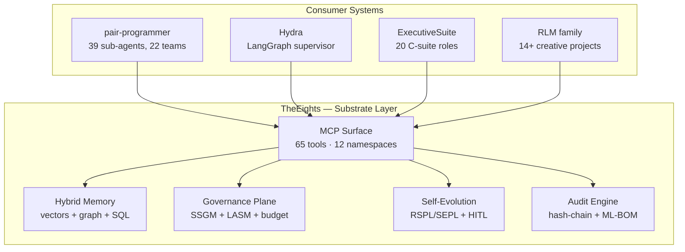
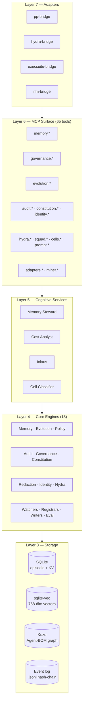
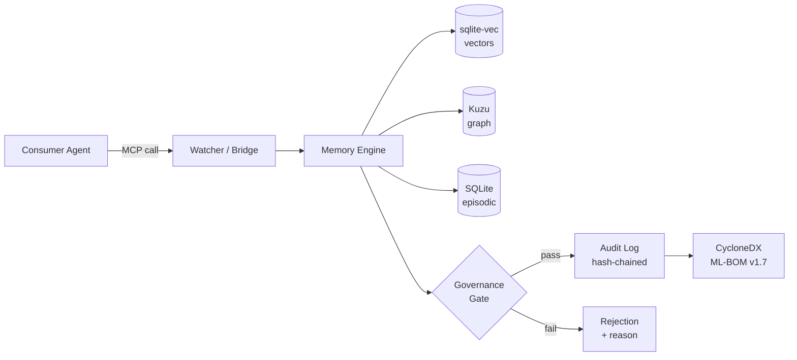
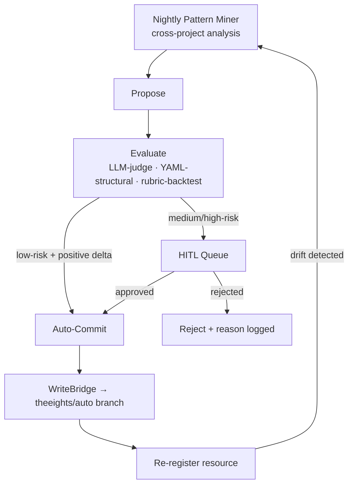
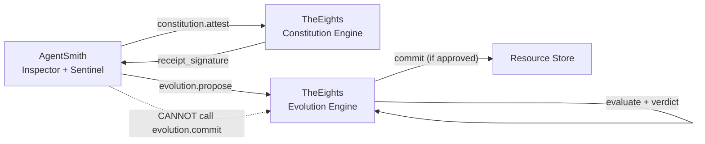

# TheEights

**Persistent, self-evolving memory + governance fabric for AI agent ecosystems.**


TheEights is a local-first daemon and [MCP](https://modelcontextprotocol.io/) (Model Context Protocol) server. It sits *below* your orchestrators and gives them shared persistent memory, governance gates, an append-only audit graph, and a gated self-evolution loop. **It is not an orchestrator. It is the substrate.**

> **Who should use this?** If you run multiple AI agents/teams that need cross-session memory, governed resource evolution, or a tamper-evident decision trail — TheEights is the shared layer that makes that possible without coupling your agents to each other.

---

## Where TheEights Sits



---

## What You Get

| Capability | Details |
|-----------|---------|
| **Hybrid Memory** | Vectors ([sqlite-vec](https://github.com/asg017/sqlite-vec)), property graph (LadybugDB/Kuzu), episodic SQL — one MCP surface, three access paths |
| **Governance Plane** | SSGM (Structured Safety Gate Model) consistency/decay/access gates; LASM (Layered Agent Security Model) defense-in-depth; budget ledger; circuit breaker; squad-scoped redaction |
| **Gated Self-Evolution** | 1,284 evolvable resources across 4 consumers. Low-risk auto-commits; medium/high queue for HITL (Human-In-The-Loop) review |
| **Tamper-Evident Audit** | Every read/write/mutation in a hash-chained event log + [CycloneDX](https://cyclonedx.org/) ML-BOM v1.7 export |
| **Plug-Compatible** | Any MCP-capable agent connects without code changes. 65 tools across 12 namespaces |

---

## Architecture



---

## Data Flow



---

## Self-Evolution Cycle

Every prompt, team definition, rubric, workflow, and policy is a **versioned resource** managed by the RSPL (Resource-Scoped Policy Layer) / SEPL (Self-Evolution Policy Layer) engines:



---

## Governance: 10 Hard Invariants

These rules are **immutable** — the Evolution Engine cannot modify them:

1. **Tenant + scope isolation** — no resource version can broaden access
2. **Audit immutability** — no resource can disable or alter the audit engine
3. **Safety-frozen resources** — `risk_class=critical` resources are frozen by default
4. **Memory immutability under audit** — facts referenced by open decisions cannot be deleted
5. **HITL bypass prohibition** — no auto-commit for non-`low` risk classes without operator override
6. **WriteBridge sandboxing** — writes are path-contained to each consumer's root
7. **Eval rubric immutability** — judge rubrics cannot be mutated by the system they evaluate
8. **Constitution attestation at intake** — every workflow must bind to a constitution hash
9. **Squad lifecycle through Evolution Engine** — squads are resources, not raw YAML
10. **OTEL exporter is loopback-only** — no outbound telemetry HTTP from the daemon (cloud LLM providers are a separate opt-in gate)

See [ARCHITECTURE.md §12](./ARCHITECTURE.md) for full details.

---

<details>
<summary><strong>MCP Tool Reference (65 tools, 12 namespaces)</strong></summary>

| Namespace | Tools | Purpose |
|-----------|-------|---------|
| `eights.memory` | add, search, get, link, resolve, resolve_batch | Hybrid memory CRUD with handle scheme (`ep://`, `sem://`, `proc://`, `meta://`) |
| `eights.governance` | policy.evaluate, consistency_check, access.check, redact, redact_for_squad, budget.charge, cap.set, ceiling.tick, hitl.request, hitl.resolve, hitl.list, breaker.status, breaker.outcome, breaker.reset | Policy enforcement, budget control, circuit breaking |
| `eights.evolution` | register, get_resource, list_resources, propose, evaluate, commit, approve, reject, rollback, unfreeze, list_pending, detect_drift | Gated resource modification (RSPL/SEPL) |
| `eights.audit` | trace, bom, verify | Tamper-evident event log + ML-BOM export |
| `eights.constitution` | get, attest, propose_amendment | Immutable governance head (hash-chained attestation) |
| `eights.identity` | register_actor, register_project | Actor and project registry |
| `eights.hydra` | envelope.record, envelope.query, handoff.list | Cross-squad envelope store for Hydra workflows |
| `eights.squad` | list, get | Squad metadata (resources governed by Evolution Engine) |
| `eights.cells` | classify, distribution, query | Eight Cells semantic axis (vision/context/triggers/influence/risk/focus/constraints/delight) |
| `eights.prompt` | list, get, diff | Cross-consumer agent prompt registry and versioning |
| `eights.adapters` | pp.{start,stop,sync_now,register_now}, exec.{start,stop,sync_now,register_now}, rlm.{start,stop,sync_now,register_now}, hydra.register_now | Consumer adapter lifecycle control |
| `eights.miner` | run_now | Trigger cross-project pattern mining |

</details>

---

## Connected Projects

TheEights is the shared substrate — these systems read from and write to it but remain fully independent:

| Project | Role in the Ecosystem | Integration |
|---------|----------------------|-------------|
| [**AgentSmith**](https://github.com/lebobo88/AgentSmith) | Meta-governance daemon — enforces 10 immutable invariants across all projects | EightsBridge MCP client; constitution attestation; proposes evolutions but cannot commit (TheEights holds the verdict) |
| [**Hydra**](https://github.com/lebobo88/Hydra) | LangGraph multi-squad supervisor and dispatcher | Constitution attestation at intake; envelope recording; budget enforcement |
| [**pair-programmer**](https://github.com/lebobo88/pair-programmer) | Coding harness with 39 sub-agents, 22 teams, taxonomy gates, judges | Watcher ingests run verdicts + artifacts; registrar tracks 59 resources |
| [**ExecutiveSuite**](https://github.com/lebobo88/ExecutiveSuite) | 20 C-suite agent roles + 4 multi-exec orchestrators | Decision memo ingestion → Agent-BOM graph; 42 governed resources |
| [**MarketBliss**](https://github.com/lebobo88/MarketBliss) | Marketing organization — 15 specialist agents across 5 Hydra squad packs | Episodic + semantic memory for campaigns; evolution-governed brand-voice and persona resources |
| [**RLM-Creative**](https://github.com/lebobo88/rlm-creative) | 9-phase creative pipeline (14+ sibling projects) | Event normalization from `events.jsonl`; 1,175 governed resources |

### How AgentSmith + TheEights Work Together

AgentSmith is the ecosystem's "antibody system" — it validates, inspects, and quarantines artifacts across all projects. TheEights is the memory and evolution substrate it depends on:



- **Smith proposes, TheEights decides.** AgentSmith can detect drift and propose resource changes via `eights.evolution.propose`, but only TheEights' Evolution Engine can issue the commit verdict. This prevents the governance layer from unilaterally mutating the systems it governs.
- **Constitution attestation** — Smith validates its own invariants against TheEights' hash-chained constitution at startup and before any enforcement action.
- **Concurrency-safe** — TheEights' audit engine handles the dual-spawn race between AgentSmith's EightsBridge and other MCP clients (Claude Code, pair-programmer) via serialized append.

---

## Quickstart

### Prerequisites

- **Node.js 20+** and npm
- **An embedding/LLM provider** (any one of):
  - **Ollama** (default, local) — install from [ollama.com](https://ollama.com) and pull models:
    ```bash
    ollama pull nomic-embed-text          # embeddings (recommended)
    ollama pull gpt-oss:20b               # completions (optional, requires opt-in)
    ```
  - **OpenAI API** — set `EIGHTS_PROVIDER=openai` + `EIGHTS_OPENAI_API_KEY` + `EIGHTS_ALLOW_CLOUD_PROVIDERS=1`
  - **DeepSeek API** (completions only) — set `EIGHTS_LLM_PROVIDER=deepseek` + `EIGHTS_DEEPSEEK_API_KEY` + `EIGHTS_ALLOW_CLOUD_PROVIDERS=1`
  - **AuthHub SDK** (local-only, never committed) — see [Provider Configuration](#provider-configuration)
  
  All providers are optional. Without any, search falls back to episodic keyword matching and completions gracefully degrade.

### 1. Clone and Build

```bash
git clone https://github.com/lebobo88/TheEights.git
cd TheEights/daemon
npm install
npm run build
```

For the CLI (optional):
```bash
cd ../cli
npm install
npm run build
```

### 2. Register as MCP Server

TheEights uses the [Model Context Protocol](https://modelcontextprotocol.io/) stdio transport. Any MCP-compatible client can connect.

**Generic MCP client** — add to your client's server configuration (the exact file/format varies by client):

```jsonc
{
  "mcpServers": {
    "eights": {
      "command": "node",
      "args": ["<path-to-clone>/TheEights/daemon/dist/index.js"],
      "transport": "stdio"
    }
  }
}
```

**Claude Code:**

```bash
# Use an ABSOLUTE path to the built daemon. A user-scope server is launched from
# whatever directory the session started in, so a relative path like
# ./daemon/dist/index.js only resolves when the cwd happens to be this repo —
# it fails (server won't connect) in every other project.
claude mcp add eights --scope user -- node /absolute/path/to/TheEights/daemon/dist/index.js
```

On Windows, the idempotent helper does this for you (derives the path from its own
location, so it stays correct after a re-clone):

```powershell
pwsh -NoProfile -File scripts/register-eights-mcp.ps1
```

**Cursor / Continue / other MCP hosts:** follow the same pattern — point the host's MCP config at `node <absolute-path>/daemon/dist/index.js` over stdio.

The daemon creates its state directory on first run:
- **Linux/macOS:** `~/.eights/`
- **Windows:** `%USERPROFILE%\.eights\`
- **Override:** set the `EIGHTS_HOME` environment variable

### 3. Verify

```bash
# From the repo root — quick health check
node ./cli/dist/index.js status
```

If Ollama is not running, you'll see `embedAvail: false` — this is expected and non-fatal. If `EIGHTS_LLM_COMPLETIONS` is unset, you'll see `llmEnabled: false` (completions are opt-in).

---

## Standalone Usage

TheEights works without any consumer system connected. Minimal example via any MCP client:

```
# Add a memory
eights.memory.add { content: "React 19 uses server components by default", tags: ["react", "architecture"] }

# Search memories (vector + episodic hybrid)
eights.memory.search { query: "server components", limit: 5 }

# Register a resource for evolution tracking
eights.evolution.register { kind: "prompt", name: "my-agent-v1", content: "..." }

# Check governance health
eights.governance.consistency_check { }
```

---

## Project Layout

```
TheEights/
├── daemon/src/
│   ├── mcp/             12 namespaces, 65 MCP tools
│   ├── engines/         18 engines (core + watchers + registrars + writers + eval)
│   ├── stores/          SQLite, sqlite-vec, Kuzu/LadybugDB
│   ├── cognitive/       Memory Steward, Cost Analyst, Iolaus, Cell Classifier
│   ├── providers/       LLM/embedding provider factory (Ollama, OpenAI, DeepSeek, AuthHub)
│   │   └── local/       Gitignored — AuthHub SDK implementations (never committed)
│   ├── adapters/        pp-bridge, hydra-bridge, execsuite-bridge, rlm-bridge
│   ├── schemas/         7 domain models (Zod + JSON Schema export)
│   └── observability/   OTEL sink (localhost-only, opt-in)
├── cli/                 Thin CLI shim over MCP
├── integrations/hydra/  Python adapter for LangGraph nodes
├── adrs/                8 Architecture Decision Records
├── .env.example         Annotated environment variable template
├── ARCHITECTURE.md      Reference architecture (read this first)
├── ROADMAP.md           Phased delivery plan
└── AGENTS.md            Behavioral contract for AI agents
```

---

## Status

| Phase | Name | Status |
|-------|------|--------|
| 0 | Foundations — daemon, stores, basic MCP | Done |
| 1 | pair-programmer bridge — cross-run recall | Done |
| 2 | Governance plane — SSGM, LASM, redaction | Done |
| 3 | Evolution engine — RSPL/SEPL, HITL queue | Done |
| 4 | Cross-project adapters + pattern mining | Done |
| 5 | Self-evolution closed-loop + WriteBridges | Done |
| 6 | Hydra manifesto alignment (11 tracks) | Done |

**Current:** v0.3.0 — 65 MCP tools, 43/43 tests passing, 1,284 evolvable resources across 4 consumers.

See [ROADMAP.md](./ROADMAP.md) for exit criteria per phase.

**Out of scope for v1:** cloud/multi-tenant deployment, pgvector, Neo4j/Memgraph, Web UI. (Cloud LLM providers are opt-in — see [Provider Configuration](#provider-configuration).)

---

## Architecture Decision Records

| ADR | Decision |
|-----|----------|
| [0001](./adrs/0001-sqlite-vec-over-pgvector.md) | sqlite-vec over pgvector — embedded, no external process |
| [0002](./adrs/0002-ladybug-over-kuzu.md) | LadybugDB over Neo4j/Memgraph — embedded property graph |
| [0003](./adrs/0003-node-daemon-mcp-first.md) | Node 20 daemon, MCP-first surface |
| [0004](./adrs/0004-autogenesis-resource-model.md) | Autogenesis resource model (RSPL/SEPL) |
| [0005](./adrs/0005-ssgm-gate-set.md) | SSGM gate set design |
| [0006](./adrs/0006-risk-class-evolution-policy.md) | Risk-class evolution policy |
| [0007](./adrs/0007-source-anchored-resources-and-writeback.md) | Source-anchored resources + WriteBridge |
| [0008](./adrs/0008-eval-adapter-contract-and-llm-judge.md) | Eval adapter contract + LLM judge |

---

## Design Principles

1. **Local-first, single binary.** Localhost daemon, single user. Cloud LLM/embedding providers opt-in via `EIGHTS_ALLOW_CLOUD_PROVIDERS=1`. Full cloud profile later behind the same MCP surface.
2. **Substrate, not framework.** Owns memory, audit, and evolution gating — not orchestration. Consumers keep their paradigms.
3. **Domain-agnostic.** A new domain is a namespace + scope, not a code change.
4. **MCP-first surface.** Everything exposed to agents is an MCP tool. CLI is a thin shim.
5. **Hybrid memory.** Vectors for recall, graph for relational reconstruction, SQL for episodic audit. Three paths, one store.
6. **Governed evolution.** Every modifiable resource is versioned. Changes require SSGM gates + HITL for non-low-risk.
7. **Replayable.** Any past run or evolution proposal is reconstructible from daemon state.
8. **Defense in depth.** LASM controls at each layer. Zero-trust on memory access.

---

## Development

**Prerequisites:** Node 20+, npm

```bash
cd daemon
npm install
npm run dev      # tsx watch mode (auto-restart on changes)
npm run test     # vitest (43 tests across 12 files)
npm run lint     # ESLint with @typescript-eslint/recommended-type-checked
npm run build    # production build
```

---

## Provider Configuration

TheEights supports four LLM/embedding providers. Ollama (local) is the default; cloud providers require explicit opt-in.

| Provider | Embeddings | Completions | Notes |
|----------|:----------:|:-----------:|-------|
| **Ollama** (default) | yes | yes | Local, no API key needed. Requires [Ollama](https://ollama.com) running. |
| **OpenAI** | yes | yes | `text-embedding-3-small` / `gpt-4o-mini` defaults. Set `EIGHTS_OPENAI_API_KEY`. |
| **DeepSeek** | no | yes | Completions only — no embeddings API. Set `EIGHTS_DEEPSEEK_API_KEY`. |
| **AuthHub** | yes | yes | Local-only (gitignored). Multi-provider routing via `@authhub/sdk`. |

### Provider selection

```bash
# Set both embed + LLM to the same provider:
EIGHTS_PROVIDER=openai

# Or split them (e.g., OpenAI embeddings + DeepSeek completions):
EIGHTS_EMBED_PROVIDER=openai
EIGHTS_LLM_PROVIDER=deepseek
```

`EIGHTS_EMBED_PROVIDER` and `EIGHTS_LLM_PROVIDER` override `EIGHTS_PROVIDER` when set.

### Cloud provider opt-in

All non-Ollama providers require **two gates**:

1. `EIGHTS_ALLOW_CLOUD_PROVIDERS=1` — acknowledges outbound API traffic
2. `EIGHTS_LLM_COMPLETIONS=1` — enables completions (for any provider, not just Ollama)

Without `EIGHTS_ALLOW_CLOUD_PROVIDERS=1`, cloud providers throw at startup. Without `EIGHTS_LLM_COMPLETIONS=1`, completions return null (eval, cell classifier, and miner gracefully degrade).

### Dimension mapping

Embedding dimensions are fixed per provider/model. Switching providers may require updating `EIGHTS_EMBEDDING_DIM`:

| Provider | Model | Default Dim |
|----------|-------|:-----------:|
| Ollama | `nomic-embed-text` | 768 |
| OpenAI | `text-embedding-3-small` | 1536 |
| OpenAI | `text-embedding-3-large` | 3072 |
| AuthHub | depends on routed model | varies |

OpenAI's `text-embedding-3-*` supports dimension truncation — set `EIGHTS_OPENAI_EMBED_DIM=768` to match an existing Ollama-populated vector store.

**If dimensions change:** delete `~/.eights/state.db` and let it rebuild (existing vectors are incompatible across dimensions).

### DeepSeek

DeepSeek provides completions only (no embeddings API). Setting `EIGHTS_EMBED_PROVIDER=deepseek` falls back to `NullEmbedder` (episodic search only).

### AuthHub (local-only)

AuthHub integration uses the `@authhub/sdk` package and is **never committed** to the repo. The implementation files live in `daemon/src/providers/local/` (gitignored).

**Setup:**
1. Install the SDK locally: `cd daemon && npm install @authhub/sdk`
2. The `local/authhub-embedder.ts` and `local/authhub-completer.ts` files are already present locally (gitignored)
3. Set `EIGHTS_AUTHHUB_BASE_URL`, `EIGHTS_AUTHHUB_API_KEY`, and `EIGHTS_ALLOW_CLOUD_PROVIDERS=1`
4. Optionally set `EIGHTS_AUTHHUB_ROUTE_ALIAS` for AuthHub's intelligent provider routing

If the local files or SDK are absent, AuthHub gracefully degrades to `NullEmbedder` / `NullCompleter`.

---

## Configuration

See [`.env.example`](./.env.example) for a complete annotated template.

### Core

| Variable | Default | Purpose |
|----------|---------|---------|
| `EIGHTS_HOME` | `~/.eights/` (`%USERPROFILE%\.eights\` on Windows) | Runtime state directory |
| `EIGHTS_LOG_LEVEL` | `info` | Pino log level |

### Provider Selection

| Variable | Default | Purpose |
|----------|---------|---------|
| `EIGHTS_PROVIDER` | `ollama` | Sets both embed + LLM provider. Values: `ollama`, `openai`, `deepseek`, `authhub` |
| `EIGHTS_EMBED_PROVIDER` | ← `EIGHTS_PROVIDER` | Override embed provider independently |
| `EIGHTS_LLM_PROVIDER` | ← `EIGHTS_PROVIDER` | Override LLM provider independently |
| `EIGHTS_ALLOW_CLOUD_PROVIDERS` | `0` | Must be `1` for any non-Ollama provider |
| `EIGHTS_LLM_COMPLETIONS` | `0` | Must be `1` to enable completions for any provider |

### Ollama (local, default)

| Variable | Default | Purpose |
|----------|---------|---------|
| `EIGHTS_OLLAMA_URL` | `http://localhost:11434` | Ollama endpoint |
| `EIGHTS_EMBEDDING_MODEL` | `nomic-embed-text` | Embedding model name |
| `EIGHTS_EMBEDDING_DIM` | `768` | Embedding vector dimensions (must match model) |
| `EIGHTS_LLM_MODEL` | `gpt-oss:20b` | Primary LLM model |
| `EIGHTS_LLM_FALLBACK` | `qwen3:4b` | Fallback LLM model if primary unavailable |

### OpenAI

| Variable | Default | Purpose |
|----------|---------|---------|
| `EIGHTS_OPENAI_API_KEY` | — | Required when using OpenAI |
| `EIGHTS_OPENAI_BASE_URL` | `https://api.openai.com` | API base URL (bare origin, no `/v1`) |
| `EIGHTS_OPENAI_EMBED_MODEL` | `text-embedding-3-small` | Embedding model |
| `EIGHTS_OPENAI_EMBED_DIM` | `1536` | Embedding dimensions (supports truncation) |
| `EIGHTS_OPENAI_LLM_MODEL` | `gpt-4o-mini` | Completion model |

### DeepSeek

| Variable | Default | Purpose |
|----------|---------|---------|
| `EIGHTS_DEEPSEEK_API_KEY` | — | Required when using DeepSeek |
| `EIGHTS_DEEPSEEK_BASE_URL` | `https://api.deepseek.com` | API base URL |
| `EIGHTS_DEEPSEEK_LLM_MODEL` | `deepseek-v4-flash` | Completion model (completions only, no embeddings) |

### AuthHub (local-only)

| Variable | Default | Purpose |
|----------|---------|---------|
| `EIGHTS_AUTHHUB_BASE_URL` | — | Required when using AuthHub |
| `EIGHTS_AUTHHUB_API_KEY` | — | Required when using AuthHub |
| `EIGHTS_AUTHHUB_EMBED_MODEL` | `text-embedding-3-small` | Embedding model (routed through AuthHub) |
| `EIGHTS_AUTHHUB_EMBED_DIM` | `1536` | Embedding dimensions |
| `EIGHTS_AUTHHUB_LLM_MODEL` | `gpt-4o-mini` | Completion model (routed through AuthHub) |
| `EIGHTS_AUTHHUB_ROUTE_ALIAS` | — | Optional: AuthHub pool routing alias |

### Observability

| Variable | Default | Purpose |
|----------|---------|---------|
| `EIGHTS_OTEL_ENABLED` | `0` | Enable OpenTelemetry exporter (localhost-only; refuses non-loopback) |
| `EIGHTS_OTEL_ENDPOINT` | `http://localhost:4318/v1/traces` | OTEL endpoint (must be loopback) |

### Consumer / Sibling Repo Roots

Locations of the sibling repos TheEights watches and writes back to. Resolved in `daemon/src/config.ts` and used by the registrars, watchers, and write bridges; they define the writeback sandbox (see [ADR-0007](./adrs/0007-source-anchored-resources-and-writeback.md)). Defaults derive from the parent directory of this clone, so a side-by-side clone usually needs none of these. The daemon reads `process.env` directly (it does **not** load `.env`), so set overrides in the actual environment — e.g. the `.claude.json` MCP server `env` block.

| Variable | Default | Purpose |
|----------|---------|---------|
| `EIGHTS_SIBLINGS_ROOT` | parent dir of the TheEights clone | Base directory for the per-repo defaults below |
| `EIGHTS_HYDRA_ROOT` | `<siblings>/Hydra` | Hydra repo root |
| `EIGHTS_PP_ROOT` | `<siblings>/pair-programmer` | pair-programmer repo root (∪ `~/.claude`) |
| `EIGHTS_EXECSUITE_ROOT` | `<siblings>/ExecutiveSuite` | ExecutiveSuite repo root |
| `EIGHTS_EXEC_OUTPUT_ROOT` | `<execsuite>/output` | ExecutiveSuite output dir the watcher tails |
| `EIGHTS_RLM_ROOT` | `<siblings>` | **Scan** root: readdir base for `^RLM*` sibling dirs |
| `EIGHTS_RLM_STARTER_ROOT` | `<siblings>/RLM-CLI-Starter` | Canonical RLM-CLI-Starter repo root |

### Development

| Variable | Default | Purpose |
|----------|---------|---------|
| `EIGHTS_GRAPH_DRIVER` | `ladybug` | Graph driver: `ladybug`, `kuzu`, or `stub` |
| `EIGHTS_DISABLE_WATCHERS` | `0` | Disable scheduled jobs (`1` = disabled) |
| `EIGHTS_SKIP_AUDIT_CHECK` | `0` | Boot despite broken audit chain (`1` = skip) |

---

## License

[MIT](./LICENSE)
